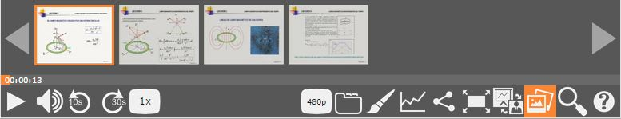

# es.upv.paella.frameControlPlugin

This plugin adds the functionability of jump to any time in the timeline where the slides are changed through a little images preview interface.



## Plugin Type:
- [paella.ButtonPlugin](../developer/plugin_types.md)

## Config Example:

```json
{
	"es.upv.paella.frameControlPlugin": 
	{
		"enabled":true
	},
}
```
