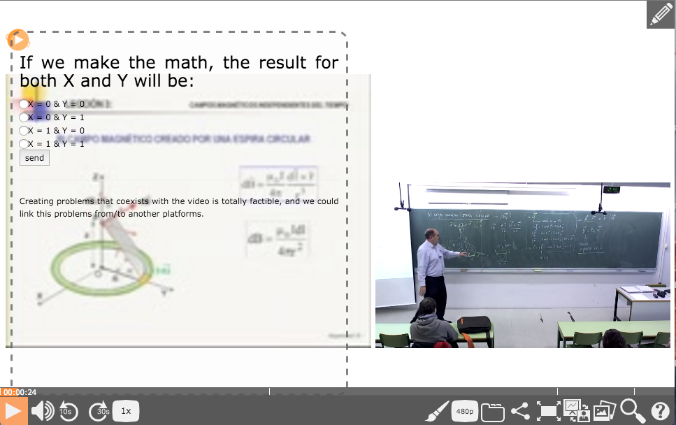
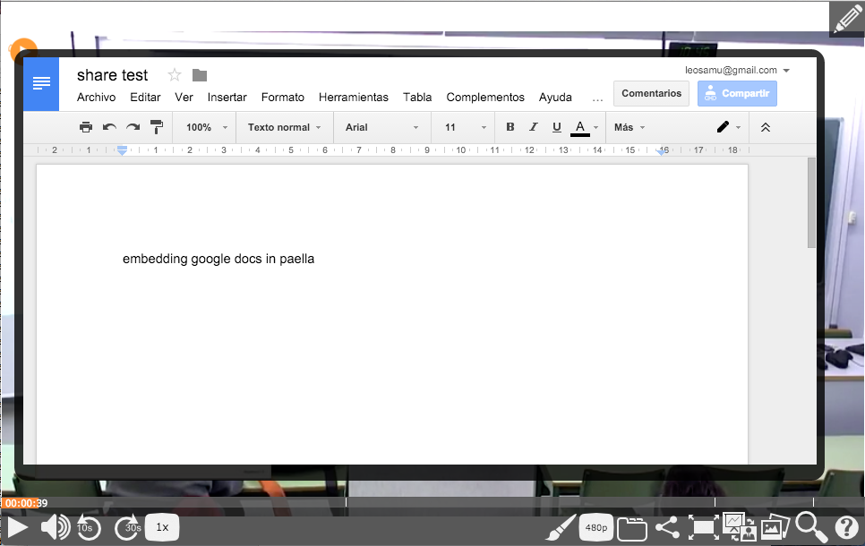

# Introduction
Paella has inherited the use of annotations from matterhorn, and they are used
to keep a track of some functionality of the video, like breaks and trimming.
This plugin integrates the use of annotations, and brings the visual annotations
functionality to paella. Letting the user create ads, notes and other kind
of visual annotations that will be displayed over the player.

This brings to paella the capability to create more interactive videos, update info
and add correction notes to old videos and more cool functionality to the already
awesome player.

## Plugin Type:
- [paella.userTracking.EventDrivenPlugin](../developer/plugin_types.md)

## Data delegate definition
- "visualAnnotations": "VisualAnnotationsDataDelegate"

## Configuration Parameters

* **url**

	URL to the data server.
	- required

## Config Example:

```json
{
	"es.upv.paella.visualAnnotationPlugin": {
		"enabled": true,
		"url": "https://my.media.server"
	}
}
```

## Annotation plugin
An anotation is defined with a json format that paella player will read from its
data delegate. Each annotation has the following elements.

1. **_id** (string) will contain the annotation id
2. **user** (string) will contain the user that created the annotation
3. **video** (string) will contain the videoid where the annotation is included
4. **type** (string) defines the type of annotation this plugin handles
* AD, BANNER, NOTE, MEMO, FULL, VCUSTOM
5. **time** (int) starting time to appear the annotation in seconds
6. **duration** (int) duration in wich the annotation will be shown
7. **content** (mixed) defines the content this may vary depending on the annotation
type. Here we will define de standar data stored here for visual annotations.
 * **Data** (obj) Stores the content for each language of the annotation with
 html5. We have to define a subelement for each language named like the language
 abreviation name.
 * **pauser** (bool) defines if the annotation pauses paella once its duration
 expires
 * **profile** (string) when the annotation appears it may change paella profile
 this defines the profile that will be active during the annotation, this may be blank
 in case we dont desire this behaviour
 * **style** defines the css style that will be applied to the annotation content

An example of an annotation json will be like

```json
{
   "_id" : "e28e0130-9824-11e5-88b4-a94245a618bnd",
   "video" : "7a85bac5-fcdf-4989-8e98-6166bef80bea",
   "user" : "3818f61e-b2c4-425c-bff7-b778cb2f9966",
   "type" : "BANNER",
   "time" : 6,
   "duration" : 4,
   "content" : "{\"data\":{\"en\":\"<p>Sometimes you will need more space than just a little Ad, to write what you want to write.</p><p>Or simply a bigger banner to include logos and publicity.</p>\"},        \"pauser\":false,             \"profile\":\"\", \"style\":\"#e28e0130-9824-11e5-88b4-a94245a618bnd {color:rgba(255,255,255,1);background-color: rgba(0,0,0,0.6);text-align: justify;-moz-border-radius: 15px;border-radius: 15px;line-height: 3vmin;font-size: 1.2vw;padding: 1vw;position: absolute;bottom:70px;left:30px;right:30px;} #e28e0130-9824-11e5-88b4-a94245a618ad0:hover { background-color: rgba(0,0,0,0.8);} #e28e0130-9824-11e5-88b4-a94245a618bnd a{color: rgb(255, 230, 45);} #e28e0130-9824-11e5-88b4-a94245a618bnd a:visited{color: rgba(255, 255, 150, 0.80);}\"}",
   "__v" : 0
}
```

### Annotation types

We defined a set of visual annotation types depending on the use of the annotation.
* **AD** Used to announce video channels, websites and other stuff. This kind
of annotation will be set at the bottom left of the player as default in a small
layout
* **BANNER** A bigger layout than the **AD** that covers all the bottom of the video
can be used to include bigger banners and subtitle like annotations.
* **NOTE** This will be using a quarter of the video size and set on the left.
Could be used to add notes that adds value to the video itself.
* **MEMO** Using the vertical left half of the screen this kind of annotation
benefits with the profile change feature and we can include inline problems,
even replace video slides shown in the video second channel.
* **FULL** A full screen annotation that will be set over the video, ideal to
show that info that need more room, like an opening / ending banner with links
to another videos or a big annotation explaining in text what video is telling you
in the background, even a pdf file that you'll like to link to.

Even since we let the user insert and create annotations with any style values,
we have defined for each of the types of visual annotation a set of predefined styles
which represent the size and position of the annotation over the video.
This values could be changed afterwards but we suggest them as starting values.

For de definition of the elements over paella, paella let us create layers over
the player where we can deploy the elements to fulfill our needs, this layer
will resize according to the video window so we have to had that into account
when defining the css of the elements. A margin of 30px around the layer is convenient
the rest depends on your needs.

The types of annotations described before will have this suggested values in their style for
positioning and sizing.

Type |  Style
------------ | -------------
**AD** | { color: rgba(255,255,255,1); background-color: rgba(0,0,0,0.6); text-align: justify; -moz-border-radius: 15px; border-radius: 15px; line-height: 3vmin; font-size: 1.2vw; padding: 1vw; position: absolute; bottom: 70px; left: 30px; width: 33%; height: 16%;}
**BANNER** | { color: rgba(255,255,255,1); background-color: rgba(0,0,0,0.6); text-align: justify; -moz-border-radius: 15px; border-radius: 15px; line-height: 3vmin; font-size: 1.2vw; padding: 1vw; position: absolute; bottom: 70px; left: 30px; right: 30px;}
**NOTE** | { color: rgba(255,255,255,1); background-color: rgba(0,0,0,0.6); text-align: justify; -moz-border-radius: 15px; border-radius: 15px; line-height: 3vmin; font-size: 1.2vw; padding: 1vw; position: absolute; bottom: 70px; left: 30px; width: 40%;}
**MEMO** | { color: rgb(0,0,0); background-color: rgba(247,247,247,0.30); border-style: dashed; border-color: rgba(100,100,100,0.8); text-align: justify; -moz-border-radius: 15px; border-radius: 15px; line-height: 3vmin; font-size: 1.2vw; padding: 1vw; position: absolute; bottom: 10px; top: 10px; left: 30px; width: 50%;}
**FULL** | { color: rgba(255,255,255,1); background-color: rgba(0,0,0,0.6); text-align: justify; -moz-border-radius: 15px; border-radius: 15px; line-height: 3vmin; font-size: 1.2vw; padding: 1vw; position: absolute; bottom: 40px; top: 20px; left: 30px; right: 30px;}

### USE EXAMPLES

-Ad annotation


-Banner annotation


-Notes annotation


-Memo annotation


-Fullscreen annotation

