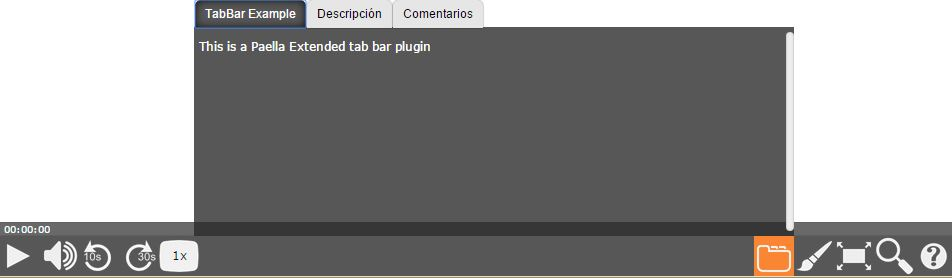

---
---

# es.upv.paella.test.tabBarExamplePlugin

This plugin is a test plugin to check that `paella.TabBarPlugin` works.



## Plugin Type

- [paella.TabBarPlugin](../../developers/plugin_types.md)

## Config Example

Here's are the config lines for this plugin:

```json
{
	"es.upv.paella.test.tabBarExamplePlugin":
	{
		"enabled":true
	}
}
```
