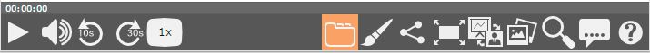

# es.upv.paella.extendedTabAdapterPlugin

This is the main control of the TabAdapterPlugin wich contains a selection of plugins from paella extended.



## Plugin Type:
- [paella.ButtonPlugin](../developer/plugin_types.md)

## Config Example:

Here's are the config lines for this plugin:

```json
{
	"es.upv.paella.extendedTabAdapterPlugin":
	{
		"enabled":true
	}
}
```
