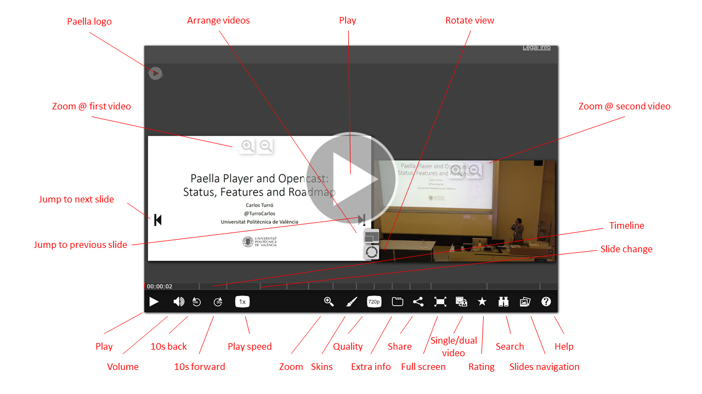

---
---

# Paella player usage guide

Here is a summary of the tools available in paella player. Keep in mind that some tools may appear disappear depending on the content (e.g the captions plugin will not appear if the video has no captions) and/or the tools that have been enabled by the site owner.

{: .img-responsive }

## Index of contents

- [Basic Usage](#basic-usage)
- [Play & Pause](#play-and-pause)
- [Volume Control](#volume-control)
- [Repeat](#repeat)
- [Speed Control](#speed-control)
- [Skin](#skin)
- [Resolution](#resolution)
- [Footprints](#footprints)
- [Share](#share)
- [Fullscreen](#fullscreen)
- [Composition](#composition)
- [Slides](#slides)
- [Editor](#editor)
- [Zoom](#zoom)

{: .img-responsive }

## Basic usage

Paella is designed to display two video windows, with the camera and the presentation view, and some information
regarding the lecture. You can navigate through the slides and tabs, but you can also begin viewing the lecture 
by pressing the play button on top of the video window or in the control bar.

{: .img-responsive }

## Play and Pause

Button for play and pause the video source. If you click outside the controls bar also stops/plays the player.

{: .img-responsive }

## Volume control

Control the volume of the video source through the popup.

{: .img-responsive }

## Repeat

Button to rewind 30 seconds into the timeline.			

{: .img-responsive }

## Speed control

Control the timeline reproduction speed.

{: .img-responsive }

## Skin

With this control we can switch between the different installed skins.

{: .img-responsive }

## Resolution

If our video has different resolutions we can swap them with this button.

{: .img-responsive }

## Footprints

With this plugin we are going to show up a new frame above the timeline for show which part of the 
video is the most played.

{: .img-responsive }

## Share

Share the video in Facebook, Twitter o take the code to embed.

{: .img-responsive }

## Fullscreen

Button for swap between Fullscreen and window mode.

{: .img-responsive }

## Composition

Use this button if you want to change the size of the sources or if you want to set another composition.

{: .img-responsive }

## Slides

Using this buttons shows the different slides in the video, clicking in the slides allows the user to jump to the same instant of time where
the slide is visualized in the video source.

{: .img-responsive }

## Editor

This buttons allows the user to enter in the editor mode.

{: .img-responsive }

{: .img-responsive }

## Zoom

Some videos has the option for zoom.

{: .img-responsive }

When zoom its activated you can zoom In and zoom Out using the mousewheel or the left controls, also you can move
around the image left clicking and dragging the mouse. You can swap between images with the arrows at the image sides.
You can take a snapshot using the button at the second button at the left bar.

{: .img-responsive }
