---
---

- <a href="#basic">Basic Usage</a>
- <a href="#playpause">Play & Pause</a>
- <a href="#volume">Volume Control</a>
- <a href="#repeat">Repeat</a>
- <a href="#speed">Speed Control</a>
- <a href="#skin">Skin</a>
- <a href="#resolution">Resolution</a>
- <a href="#footprints">Footprints</a>
- <a href="#share">Share</a>
- <a href="#fullscreen">Fullscreen</a>
- <a href="#composition">Composition</a>
- <a href="#slides">Slides</a>
- <a href="#editor">Editor</a>
- <a href="#zoom">Zoom</a>

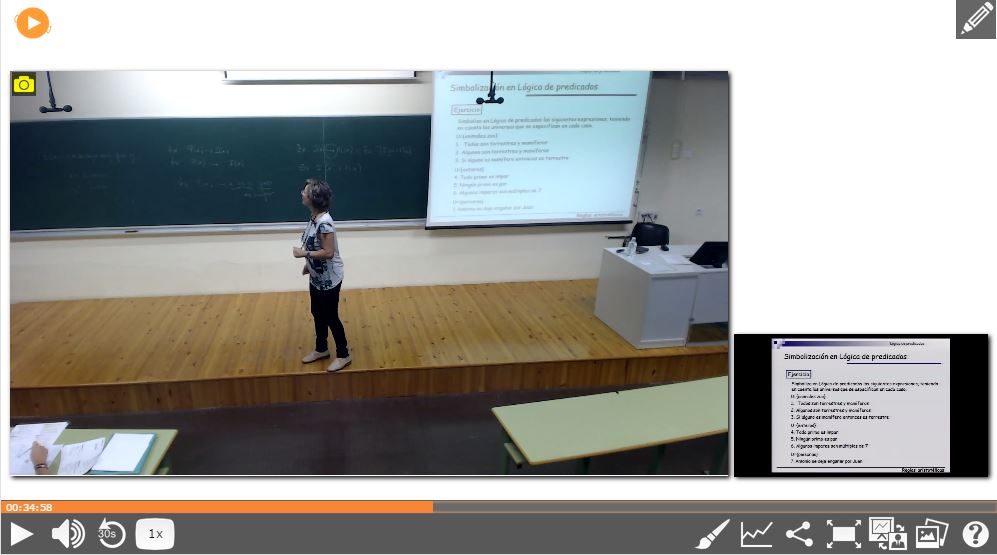{: .img-responsive }

## <A NAME="basic">1 Basic usage</a>

Paella is designed to display two video windows, with the camera and the presentation view, and some information
regarding the lecture. You can navigate through the slides and tabs, but you can also begin viewing the lecture 
by pressing the play button on top of the video window or in the control bar.

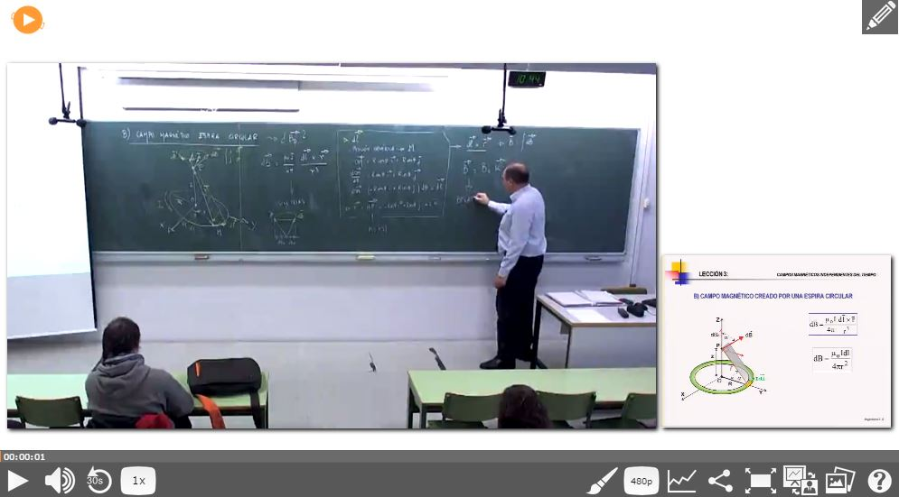{: .img-responsive }

## <A NAME="playpause">2 Play & Pause</a>

Button for play and pause the video source. If you click outside the controls bar also stops/plays the player.

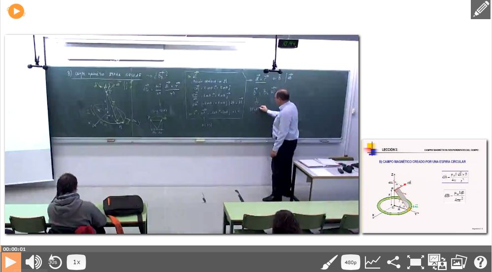{: .img-responsive }

## <A NAME="volume">3 Volume control</a>

Control the volume of the video source through the popup.

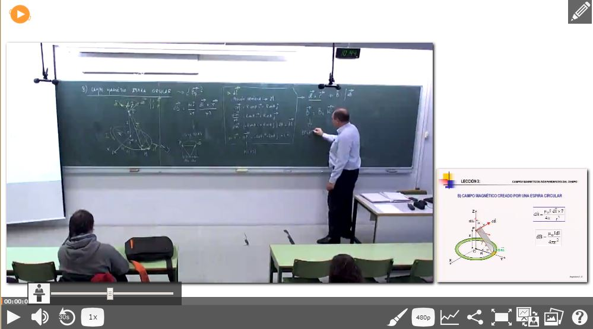{: .img-responsive }

## <A NAME="repeat">4 Repeat</a>

Button to rewind 30 seconds into the timeline.			

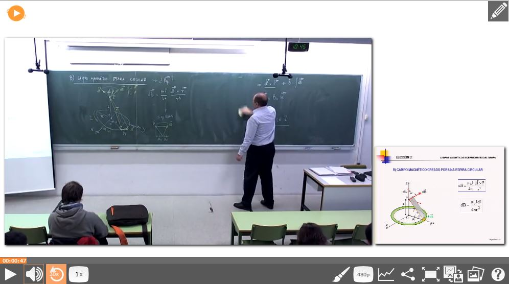{: .img-responsive }

## <A NAME="speed">5 Speed control</a>

Control the timeline reproduction speed.

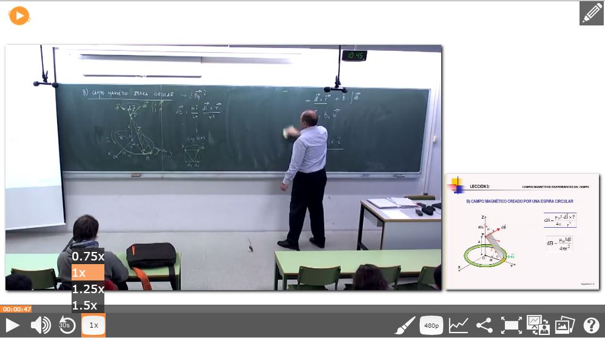{: .img-responsive }

## <A NAME="skin">6 Skin</a>

With this control we can switch between the different installed skins.

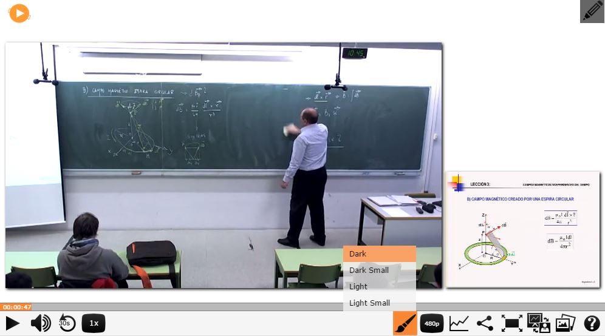{: .img-responsive }

## <A NAME="resolution">7 Resolution</a>

If our video has different resolutions we can swap them with this button.

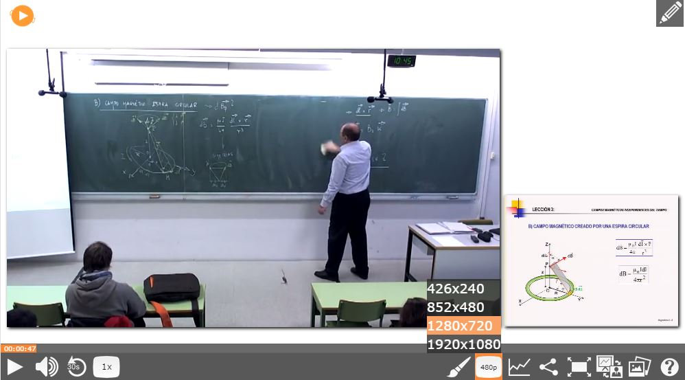{: .img-responsive }

## <A NAME="footprints">8 Footprints</a>

With this plugin we are going to show up a new frame above the timeline for show which part of the 
video is the most played.

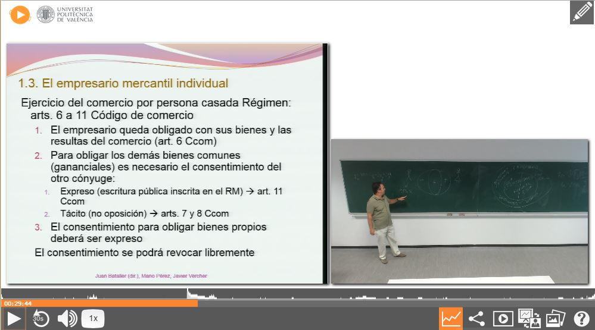{: .img-responsive }

## <A NAME="share">9 Share</a>

Share the video in Facebook, Twitter o take the code to embed.

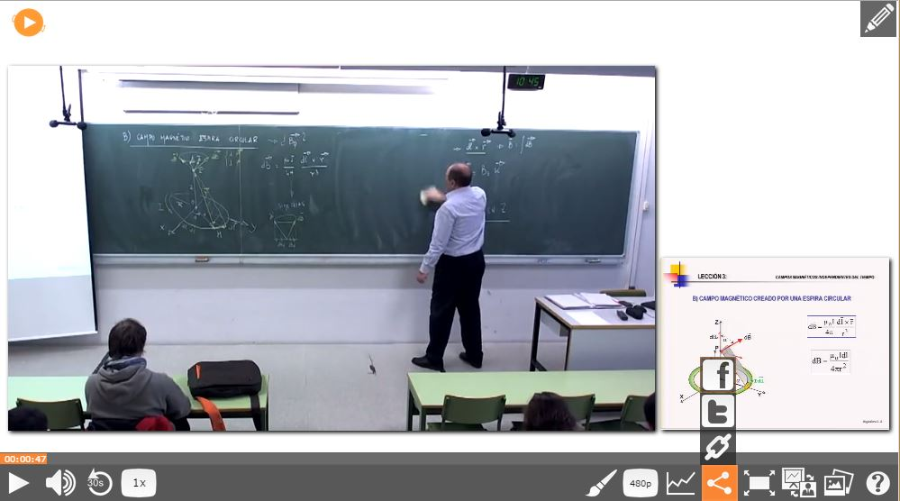{: .img-responsive }

## <A NAME="fullscreen">10 Fullscreen</a>

Button for swap between Fullscreen and window mode.

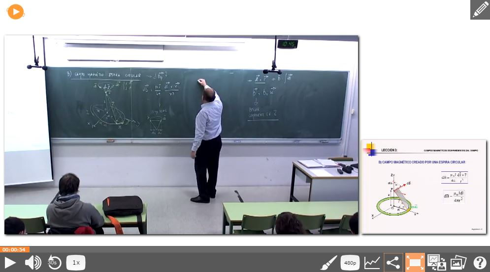{: .img-responsive }

## <A NAME="composition">11 Composition</a>

Use this button if you want to change the size of the sources or if you want to set another composition.

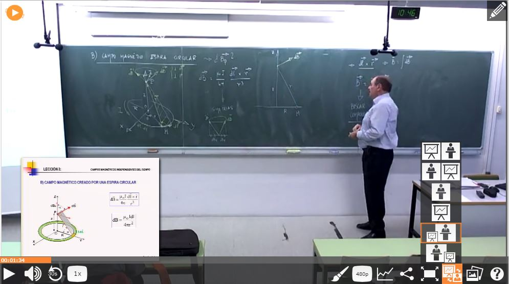{: .img-responsive }

## <A NAME="slides">12 Slides</a>

Using this buttons shows the different slides in the video, clicking in the slides allows the user to jump to the same instant of time where
the slide is visualized in the video source.

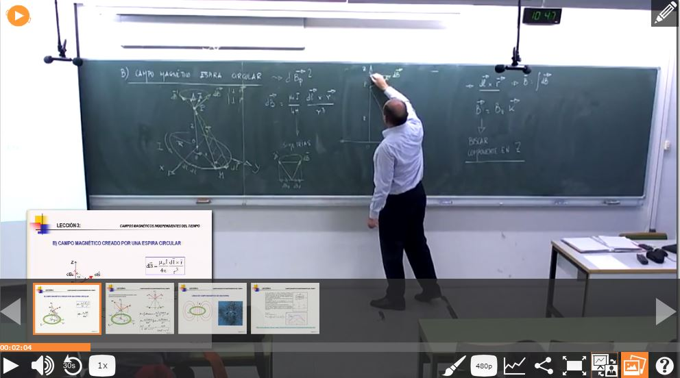{: .img-responsive }

## <A NAME="editor">13 Editor</a>

This buttons allows the user to enter in the editor mode.

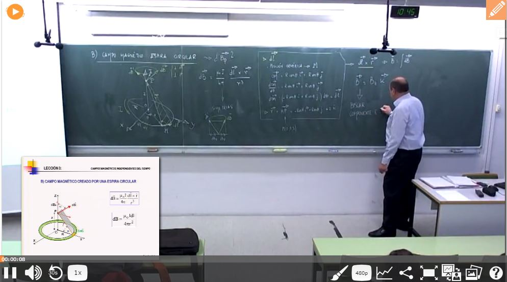{: .img-responsive }

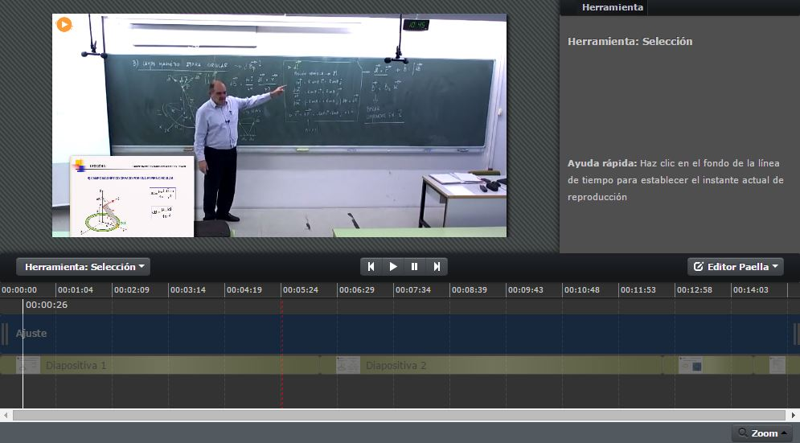{: .img-responsive }

## <A NAME="zoom">14 Zoom</a>

Some videos has the option for zoom.

{: .img-responsive }

When zoom its activated you can zoom In and zoom Out using the mousewheel or the left controls, also you can move
around the image left clicking and dragging the mouse. You can swap between images with the arrows at the image sides.
You can take a snapshot using the button at the second button at the left bar.

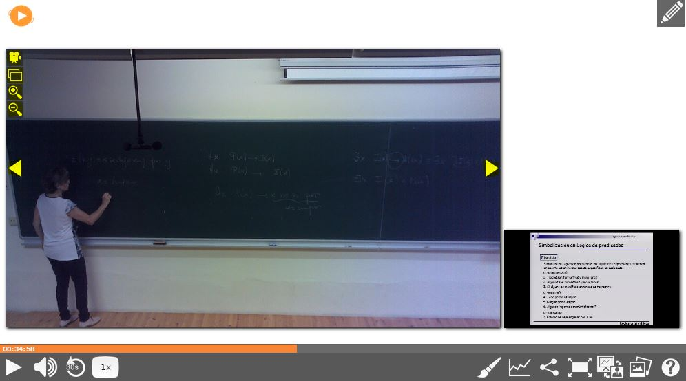{: .img-responsive }
