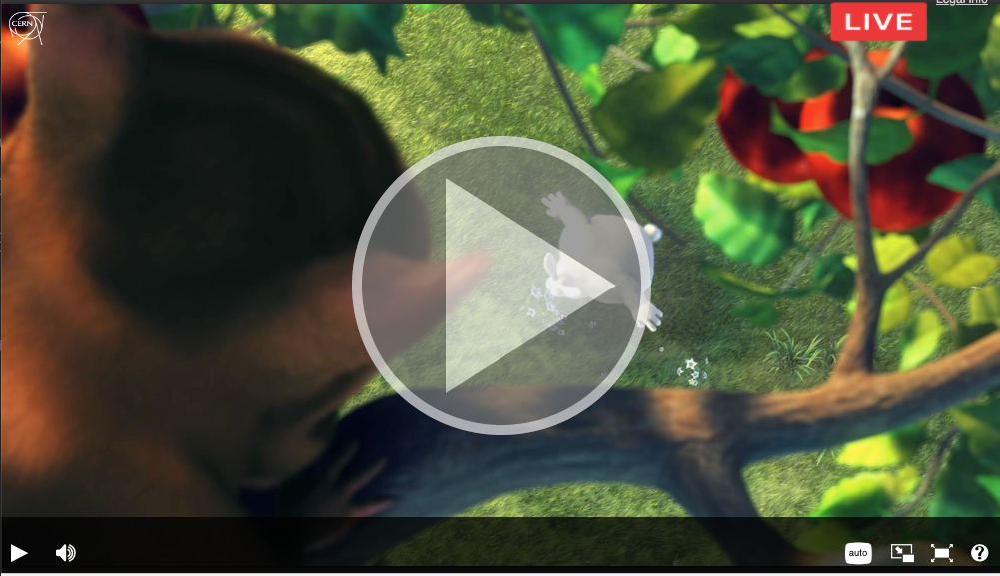

# ch.cern.paella.playButtonOnScreenAlwaysPlugin

Plugin for [Paella Player](https://github.com/polimediaupv/paella): Display always the PlayOnButtonScreen, no matter the stream is live or not



## Requirements

- Paella Player 6.3.3
- Paella Player 6.4.3

## Installation

Add `ch.cern.paella.playButtonOnScreenAlwaysPlugin` to the plugins folder.

Then you will need to modify the config/config.json file in order to activate the plugin.

1. Disable the `PlayButtonOnScreenPlugin` since this plugin will override it's behavior:

```
"es.upv.paella.playButtonOnScreenPlugin": {"enabled":false},
```

2. Enable the `PlayButtonOnScreenAlwaysPlugin`:

```
"ch.cern.paella.playButtonOnScreenAlwaysPlugin": {"enabled":true},
```


This plugin is based on the original `PlayButtonOnScreen` bundled with [Paella Player](https://github.com/polimediaupv/paella)

Installation
To install you will need a working Paella Player `v6.3.3`.